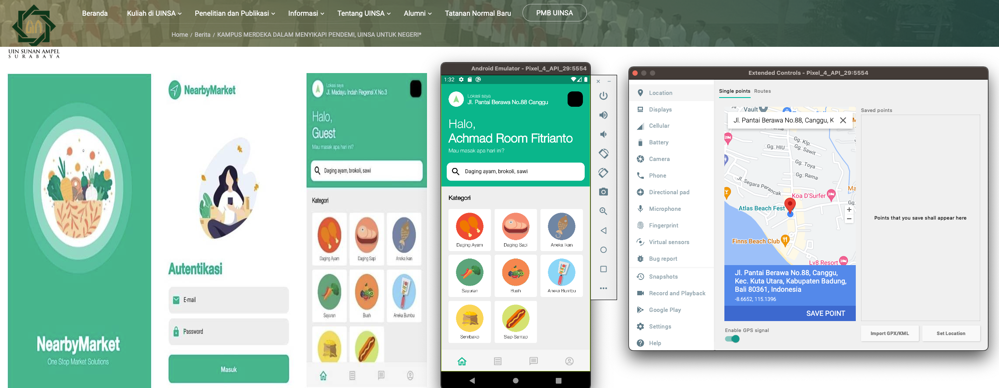
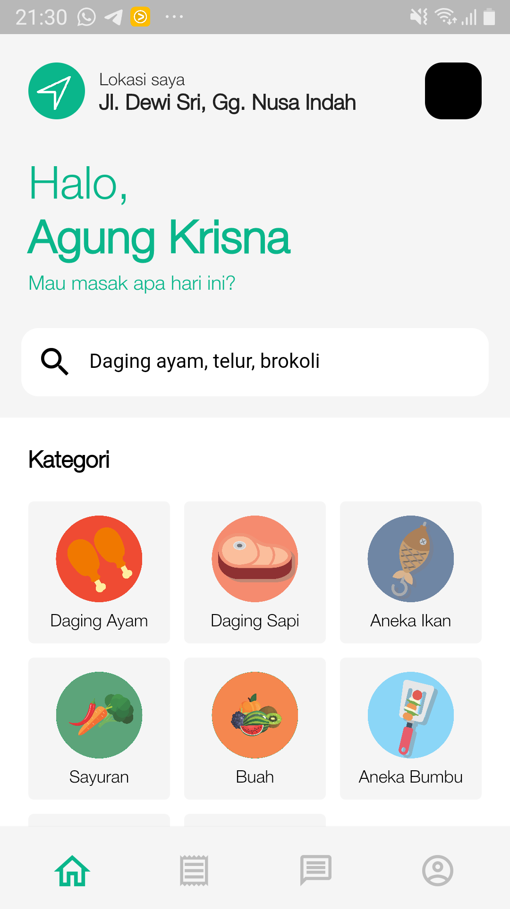
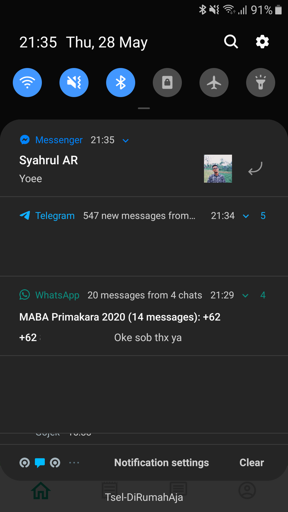
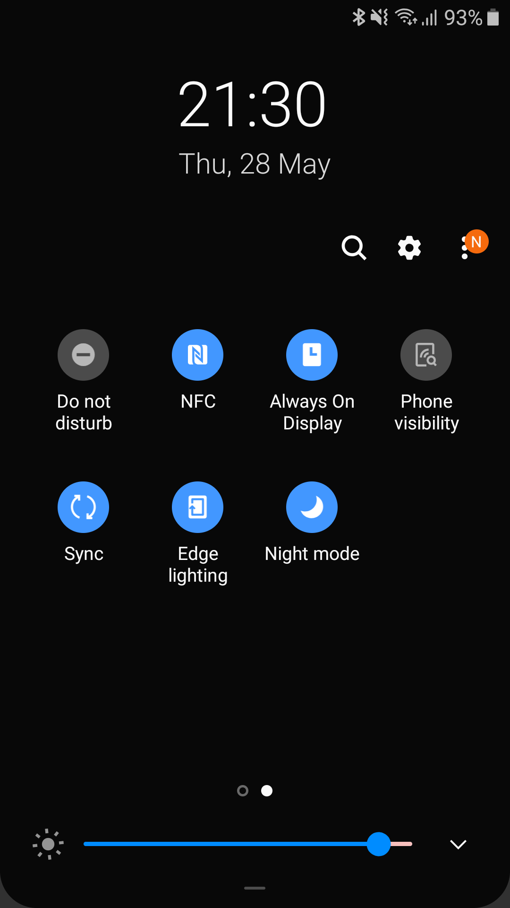

# NearbyMarket

An [MVP app](https://w3.uinsby.ac.id/kampus-merdeka-dalam-menyikapi-pendemi-uinsa-untuk-negeri/) shipped with Flutter
With Google Maps API to retrive nearest local market

To build and run the NearbyMarket app, make sure you have the following SDK versions installed:

Dart SDK: >=2.7.2 <3.0.0\
Flutter SDK: >=1.16.3 <2.0.0

Please ensure that you have the correct SDK versions installed before proceeding with the app setup.

## Preview

## Getting Started

This project is a starting point for a Flutter application.

A few resources to get you started if this is your first Flutter project:

- [Lab: Write your first Flutter app](https://flutter.dev/docs/get-started/codelab)
- [Cookbook: Useful Flutter samples](https://flutter.dev/docs/cookbook)

For help getting started with Flutter, view our
[online documentation](https://flutter.dev/docs), which offers tutorials,
samples, guidance on mobile development, and a full API reference.